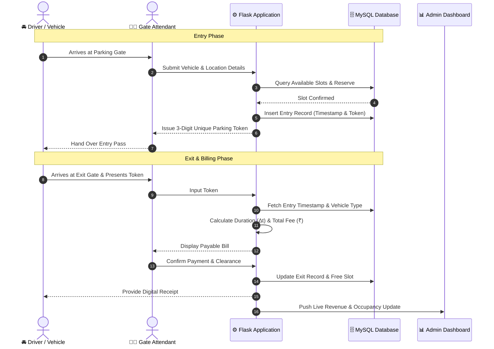

<div align="center">

  <h1>🚗 Smart Vehicle Parking Management System</h1>
  <p><strong>An automated, web-based digital parking infrastructure for smart urban cities</strong></p>

  <p>
    
    
    
    
    
  </p>

</div>

---

## 📌 Overview

The **Smart Vehicle Parking Management System** digitizes and automates the complete parking lifecycle—from real-time entry and dynamic slot assignment to precision timestamp billing and slot deallocation.

Designed to eliminate manual ticketing errors and congestion, this platform offers a streamlined interface for attendants and a centralized analytics dashboard for administrators to monitor real-time occupancy, vehicle categories, and revenue streams across multiple locations.

---

## ✨ Key Features

* 🎟️ **Instant Dynamic Slot Allocation:** Automatically searches and allocates available spots based on location and vehicle type (2-Wheeler / 4-Wheeler).
* 🔢 **Cryptographic 3-Digit Token Generation:** Generates unique, tamper-proof session tokens for frictionless entry and exit lookup.
* ⏱️ **Timestamp-Accurate Tariff Engine:** Calculates exact billing durations with variable rate tiers:
  * 🏍️ **Two-Wheelers:** ₹1 / min
  * 🚗 **Four-Wheelers:** ₹3 / min
* 📊 **Executive Real-Time Dashboard:**
  * Daily metrics (total vehicle throughput, car/bike breakdown, cumulative earnings).
  * Place-wise live occupancy monitors with percentage fill gauges.
  * Recent entry audit logs with sensitive detail masking.
* 🧾 **Automated Digital Receipts:** Generates timestamped, structured receipts upon payment and exit.
* 🛠️ **Administrative Utility Suite:** Lost token recovery workflows, dynamic rate management, and token status verification.

---

## 🏗️ System Architecture & Workflow



---

## 🗄️ Database Design

The relational schema is optimized for ACID compliance and sub-millisecond query lookups:

* **`places`**: Stores parking facility locations, total capacity, and active thresholds.
* **`parking_slots`**: Relational mapping of slots, categorization, and occupancy flags (`AVAILABLE` / `OCCUPIED`).
* **`vehicle_entry`**: Captures vehicle numbers, owner contact, assigned slot ID, entry timestamp, and unique active token.
* **`vehicle_exit`**: Archives exit timestamps, total calculated minutes, fee paid, and transaction verification.

---

## 🚀 Quickstart & Setup Guide

### 1. Prerequisites
* Python 3.9+
* MySQL Server / XAMPP

### 2. Clone the Repository
```bash
git clone https://github.com/Pranav7758051011/Smart_Vehicle_Parking_Management_System.git
cd Smart_Vehicle_Parking_Management_System
```

### 3. Install Dependencies
```bash
pip install flask mysql-connector-python
```

### 4. Database Setup
1. Create a MySQL database named `smart_parking`.
2. Configure your database credentials in `db.py` or `.env`:
```python
DB_CONFIG = {
    'host': 'localhost',
    'user': 'root',
    'password': 'your_password',
    'database': 'smart_parking'
}
```

### 5. Launch the Application
```bash
python app.py
```
Open your browser and navigate to `http://localhost:5000`.

---

## 🔒 License

Distributed under the **MIT License**. See `LICENSE` for more information.

---

<div align="center">
  <sub>Developed with precision by <strong>Pranav Bade</strong></sub>
</div>
